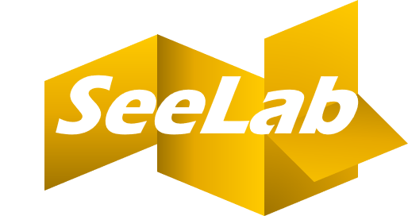
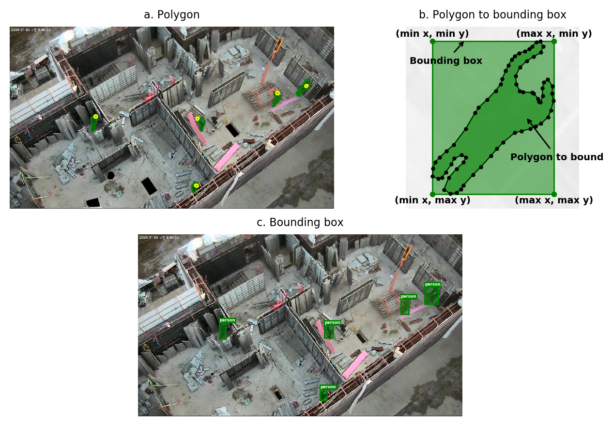

<p align="center">
  
</p>
<p align="center">
  
  
  <!--  -->
  <!--  -->
  
</p>

# seelab

Helper `labelme`

### Installation

#### Requirements

```bash
conda create -n seelab python=3.7
conda activate labelme
pip install labelme
pip install git+https://github.com/unerue/seelab.git#egg=seelab
```

### Usage
#### Check labels in dataset

`labelme` annotations

```bash
$ seelab check --labels
```

`labelme`

```bash
$ seelab check --size
```


# vision-based construction



## `branch`로 작업해서 `branch`로 푸쉬해주세요.
## 절대 `master`로 직접 `push`하시면 안됩니다.

## 브랜치 관리에 대해 자신이 없으면 `fork`해서 사본 만들어 작업하고 `pull request` 요청해주시기 바랍니다.

## `git`에 궁금한 점 있으시면 연락주세요.


## 깃 사용법(Fork해와서 협업)
1. fork클릭: 하고나면 원본 repository에서 fork: 마스터님꺼에서 내꺼로 복사 함
2. git remote -v: 주소확인(url)
3. git remote add upstream url(원본 주소)
4. git remote -v: 주소다시 확인햇더니 업뎃됨
5. git fetch upstream
6. git checkout master
7. git merge upstream/master 다운받기
8. 로컬에서 코드수정(git status로 확인)
9. git add .
10. git commit -m '설명'
11. git push
12. 마스터님께 git pull 리퀘스트하기
13. 3번으로 돌아가 반복

https://milooy.wordpress.com/2017/06/21/working-together-with-github-tutorial/